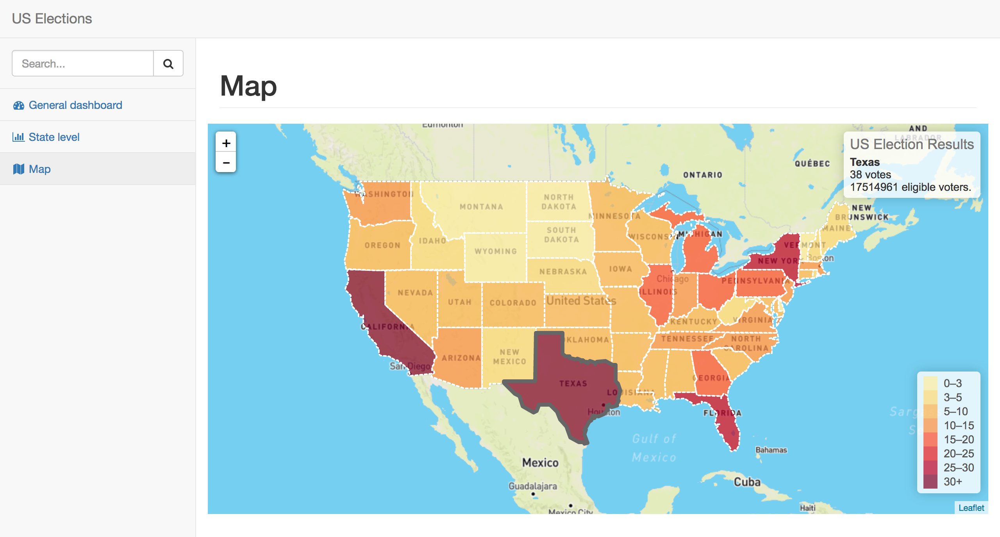
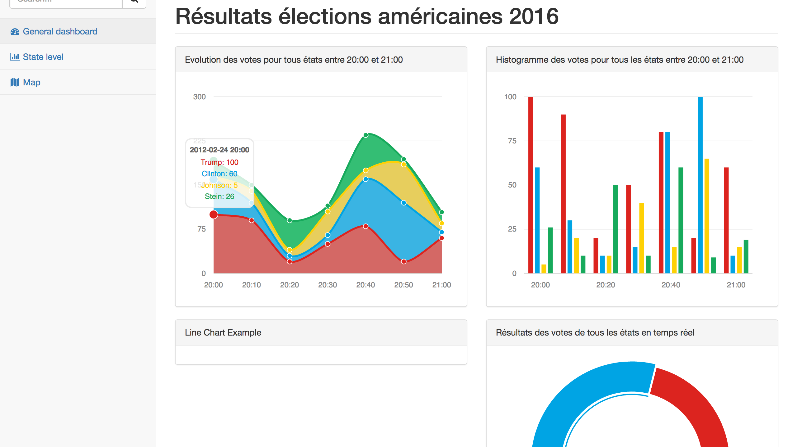

# Goal

# Installation
```
# Create virtual environment and activate it

conda create --name us_election python=3
source activate us_election

# Install requirements
pip install -r requirements.txt

# Launch server
python manage.py runserver
```
The website is then available at: http://127.0.0.1:8000/dashboard

# Preview
Interactive Map


Dashboard


# Todo
- use asyncio with motor to query MongoDB instead of multiprocessing

Optionnal:
- create models
- create an update process to query database and save it in website database
