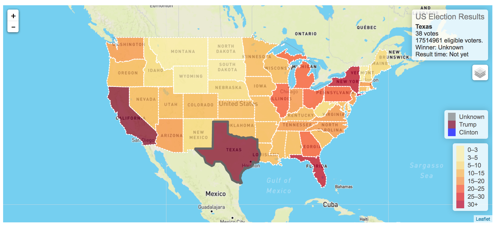
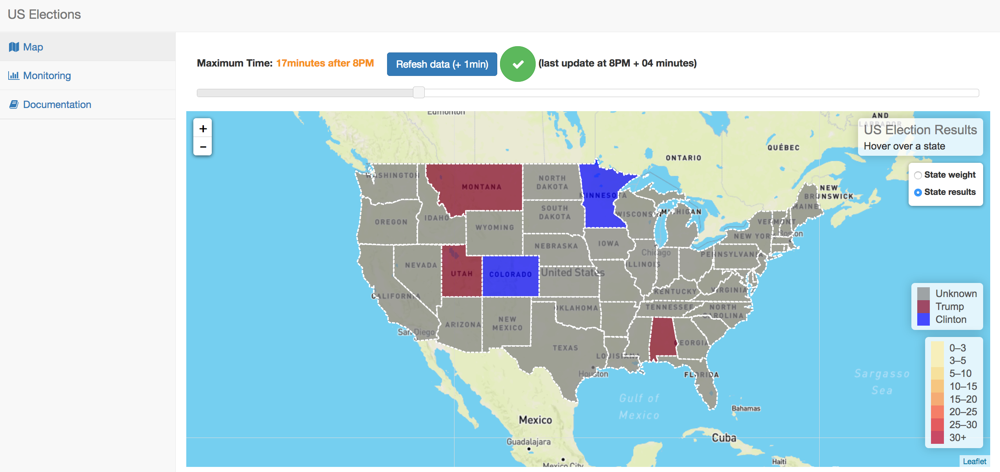
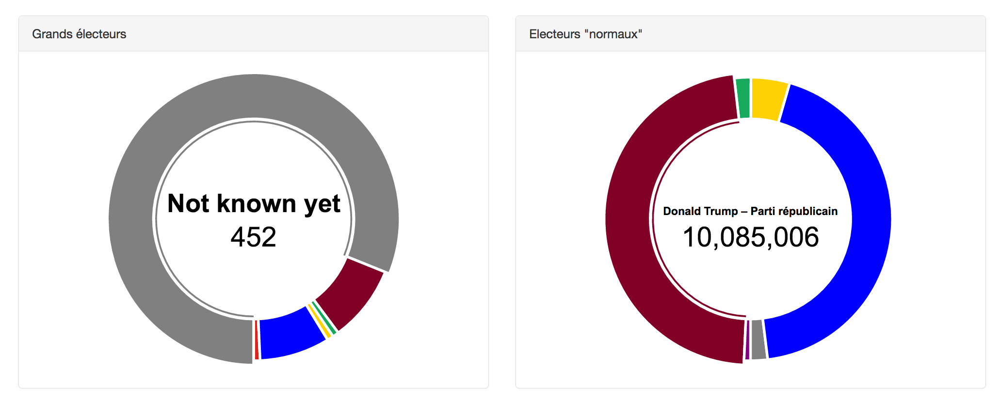
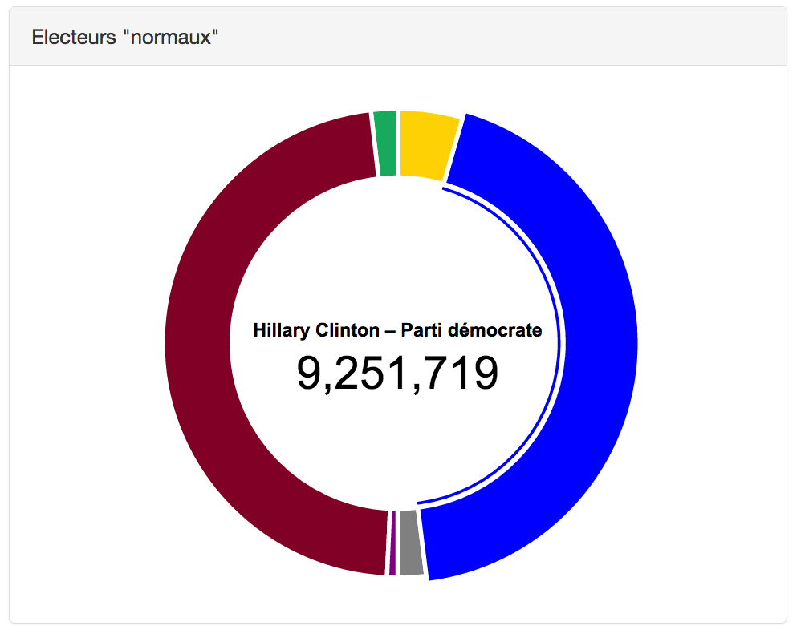
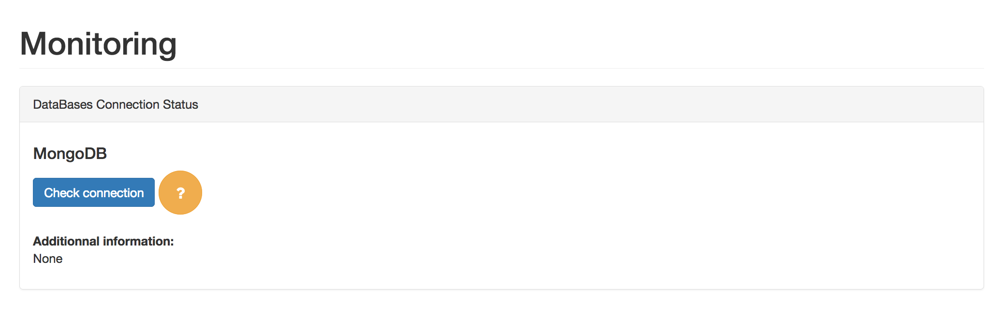
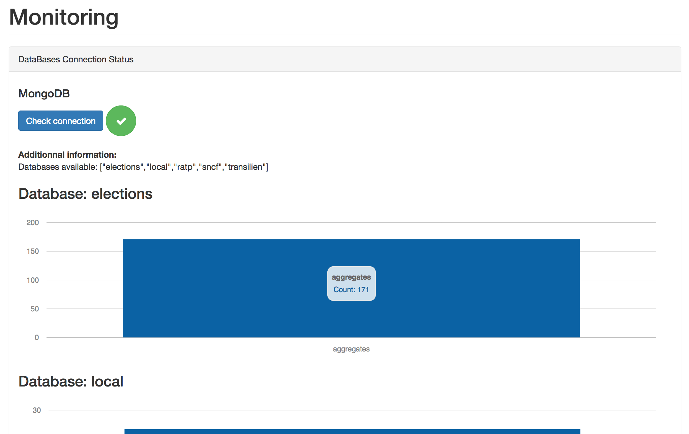

# Goal

# Installation

## Virtual env
```
# Create virtual environment and activate it

conda create --name us_election python=3
source activate us_election

# Install requirements
pip install -r requirements.txt
```

## Set up MongoDB
You have to launch a local MongoDB instance or use a distant one, and create a secret.json file in us_election/us_election/ folder with:
If you work with a local MongoDB:

```
{
    "MONGO_HOST": "localhost",
    "MONGO_PORT":"27017",

    "SECRET_KEY":"*** for prod***",
}
```
Then, to populate your database launch the set_mongo.sh script:
```
todo
```
It might take some time.

Then create indexes:
```

```

## Launch server
```
python manage.py runserver
```
The website is then available at: http://127.0.0.1:8000/dashboard

# Preview
Interactive Map



Interactive Donuts



Database monitoring



# How it works
## Databases Management and queries

##

# Todo
- use asyncio with motor to query MongoDB
